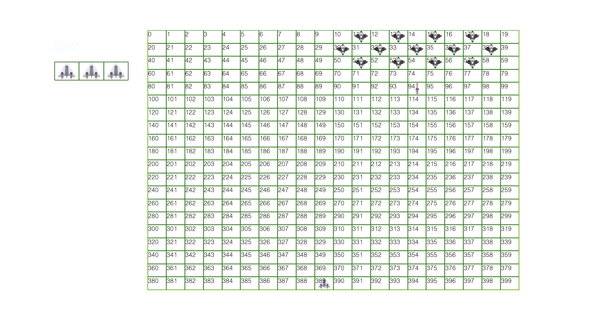

###  General Assembly, Software Engineering Immersive
# SPACE Z 

## Overview

Let's start out with something fun - **a game!**

As part of the software engineering bootcamp program the first project is to build a game from the scratch with the techlogies we have learned in the previous 3 weeks of intensive **JavaScript** so we could chalenge ourselfs with our adquired skills.

I always was facinated with the space so from the selection of games to choose, I deceided to go for the classic arcade game Space Invaders and make an adaptation of it with sounds effects taken from the movies Star Wars and inspared from Idepennce Day movie for the styling the final product I got is somehting that I ca be proud of.

 
You can play the game [here](https://dromerosalem.github.io/project-1/) 

This game was later adapted and shared by a blogger with my permission, and went viral in Mexico in his facebook fan page with more than 4 million followers. You can check the adaptation [here](https://coronagame.net/)   


## The Brief 

- **Render a game in the browser**
- **Design logic for winning & visually display which player won**
- **Include separate HTML / CSS / JavaScript files**
- Stick with **KISS (Keep It Simple Stupid)** and **DRY (Don't Repeat Yourself)** principles
- Use **Javascript** for **DOM manipulation**
- **Deploy your game online**, where the rest of the world can access it
- Use **semantic markup** for HTML and CSS (adhere to best practices)


## The Technologies used 

- HTML5
- CSS3
- JavaScript (ES6)
- Git and GitHub
- Google Fonts

### The Grid

The game is built using a grid. A 20 x 20 square is created using JavaScript. HTML divs are created using a for loop and appended as children of the grid.

 ```js

  const cellsXcells = 20
  const totalGrid = cellsXcells * cellsXcells
  const grid = document.querySelector('.grid')
  const cells = []


 for (let i = 0; i < totalGrid; i++) {

    const cell = document.createElement('div')
    // cell.innerHTML = i
    cell.classList.add('cell')
    grid.appendChild(cell)
    cells.push(cell)

  }

 ```
 During actual gameplay, the grid isn't visible, but is highlighed below for demonstration purposes:
 
 


 ### Invaders Movement

Enemy ships are defined as an array of numbers which corresponds to their position on the grid:

```js
  const invaders = [7, 9, 11, 13, 26, 28, 30, 32, 34, 47, 49, 51, 53]

```


They are then added to the grid using a for loop and the movements are defined to the right, down by 20 positions and then to the left. 


Adding the invaders

```js
    for (let i = 0; i < invaders.length; i++) {
      invaders[i] += cellsXcells
      cells[invaders[i]].classList.add('invader')
    }
```

Right Movement

```js
     else {
      cells[invaders[i]].classList.remove('invader')
      invaders[i] += invaderMove
      cells[invaders[i]].classList.add('invader')
    }

```


20 positions down 

```js
    for (let i = invaders.length - 1; i >= 0; i--) {
      cells[invaders[i]].classList.remove('invader')
      invaders[i] += cellsXcells
      cells[invaders[i]].classList.add('invader')
    }
```

Left Movement 

```js
   else {
    cells[invaders[i]].classList.remove('invader')
    invaders[i] -= invaderMove
    cells[invaders[i]].classList.add('invader')
  }

```

They start keep moving to the right until find the right wall when they jump 20 positions from his actual position and they start to move to the left until fiding the left wall and then jump once again 20 position from their actual postions. The walls were defined into an array of positions of the grid.

```js
  const rightWall = [19, 39, 59, 79, 99, 119, 139, 159, 179, 199, 219, 239, 259, 279, 299, 319, 339, 359, 379, 399]
  const leftWall = [20, 40, 60, 80, 100, 120, 140, 160, 180, 200, 220, 240, 260, 280, 300, 320, 340, 360, 380]
```

### Invaders Boobms

Invaders boobms are fired every 1000 milliseconds using a setInterval. The firing position is randomly determined using Math.random based on the position invader position. The .slice(-4) method used here means that as the number of invaders in the array decreases, the number of aliens firing reduces - rather than having enemy lasers originating from empty space.


```js
  generateBomb = setInterval(() => {
    let bomb = 0
    const invaderFront = invaders.slice(-4)
    const nuke = (Math.floor(Math.random() * invaderFront.length))

```


The `bomb` CSS class is added to the cell in front of the random ship, a sound plays and another setInterval is declared that adds and removes the CSS class until there is collision with the player or the enemy laser reaches the end of the grid. If the enemy laser collides with the player, the player disapears and reapers in his initial position.


```js
            const dropBombInterval = setInterval(() => {
         
              if (bomb >= 380) {
                cells[bomb].classList.remove('bomb')
                clearInterval(dropBombInterval)

              } else {
                cells[bomb].classList.remove('bomb')
                bomb += cellsXcells
                cells[bomb].classList.add('bomb')
                // console.log(cells[bomb])
                // console.log(bomb)
              }

              if (ship === bomb) {
                cells[bomb].classList.remove('bomb')
                cells[ship].classList.remove('ship')
                ship = 389
                cells[ship].classList.add('ship')
                life -= 1
                audio.src = 'assets/explosion.mp3'
                audio.play()
                getLifes[life].classList.remove('ship')
                if (life === 0) {
          
                  clearInterval(dropBombInterval)
                  clearInterval(generateBomb)
                  grid.style.display = 'none'
                  miniGrid.style.display = 'none'
                  music.pause()
                  audio.src = 'assets/gameOver.mp3'
                  audio.play()
                  gameOver.style.display = 'block'
                }
            
              }

            }, 200)


```

### The Player
The player is a variable defined with a number, which defines its position on the grid:

```js
  let ship = 389
```


Moving the player comes from an event listener that checks for a `keydown` event on the user's keyboard. 

Defining the player movement is done by listening to the same event from that listener so if the event is `ArrowRight`, the player will move one cell to the right, if the event is `ArrowLeft`, the player will move one cell to the left.

In order to take advantage of the same event listener the event to shoot the laser from the player is defined by `Space` event what will listern for a fuction `shoot()` what was defined previously.


```js
         document.addEventListener('keydown', (event) => {
            // console.log(event)
            if (event.key === 'ArrowRight') {
              if (ship === cells.length - 1) {
                return
              }
              cells[ship].classList.remove('ship')
              ship += 1
              cells[ship].classList.add('ship')
            } else if (event.key === 'ArrowLeft') {
              if (ship === 380) {
                return
              }
              cells[ship].classList.remove('ship')
              ship -= 1
              cells[ship].classList.add('ship')

            } else if (event.code === 'Space') {
              shoot()
              audio.src = 'assets/laser.mp3'
              audio.play()
            }

          })
```


### The Player Shoot

The player shoot was defined inside of a function called `shoot()` the shoot movements. Every time that the event listener is called by pressing the space bar a laser shoot will be generated that will keep moving up by 20 positions from the initial position from where the player was located at the moment of shooting. This movemtn is set by a `serInerval()` function that occurs every 200 milliseconds.

The movement is done by adding and removing a class from the cells and reaering 20 cells up, what is actually a -20, negative, movement.


```js
    const shootsMovement = setInterval(() => {
      if (invaders.length === 0){
        clearInterval(shootsMovement)
        grid.style.display = 'none'
        miniGrid.style.display = 'none'
        audio.src = 'assets/victory.mp3'
        music.pause()
        audio.play()
        endGame.style.display = 'block'

        clearInterval(invadersMovement)
        clearInterval(generateBomb)
        // clearInterval(dropBombInterval)
      } else if (shoots <= 19) {
        clearInterval(shootsMovement)
        cells[shoots].classList.remove('shoot')
      } else {

        cells[shoots].classList.remove('shoot')
        shoots -= 20
        cells[shoots].classList.add('shoot')

        if (cells[shoots].classList.contains('invader') === true) {
          //  const elem = invaders.length
          invaders.splice(invaders.indexOf(cells[shoots]))
          console.log(invaders)
          audio.src = 'assets/desintegration.mp3'
          audio.play()
          cells[shoots].classList.remove('invader')
          cells[shoots].classList.remove('shoot')
          clearInterval(shootsMovement)
        } 

      }

    }, 200)
  }
```

 


## Challenges
- Beeing this project the really first JavaScript project I've ever done definitely was one of th most biggest challenge as there was a due date of one week to deliver trying to make all the functions fit in the proper place when unexpected bugs that I was not counting with were happening.


## Victories 
- The invaders movement was a real victory due to the dificulty to make the response as expected, when the invaders started to move 20 positions down all together and then to the left was on of the most glorius moments of this project. 

## Potential future features

- An aditional level it will be one of the features to be added into this project, as all the invaders are killed the player will reapear into a new level where the invaders will move and shoot faster

- Mobile friendly is one of the goals I would like to implement to the game as most of thr users nowdays are navigating trough mobile web.


### [Play the game Now!](https://dromerosalem.github.io/project-1/)


